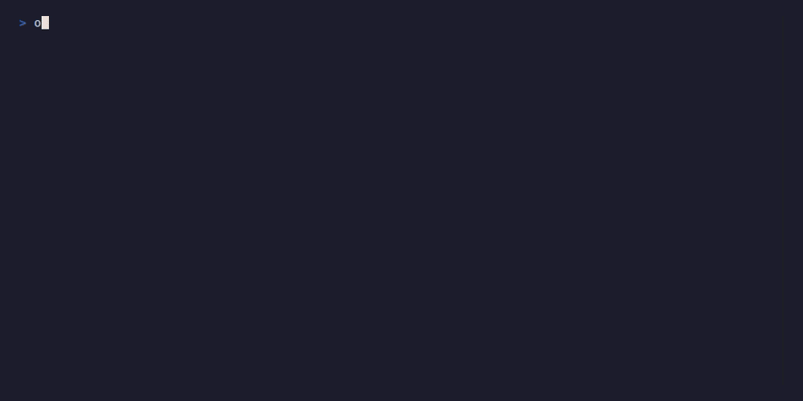

# Usage

Ox has three primary ways to start a coding task, each suited to a different workflow. This page covers the core invocation modes, agent modes, and how they combine.

## Starting a Task

### Detached (Default)

Pass a prompt as a positional argument. Ox creates the session in the background, prints the session ID to stdout, and exits immediately:

```bash
ox "Refactor the auth middleware to use JWT tokens"
```

This is designed for scripting and parallel workflows. Capture the session ID:

```bash
SESSION=$(ox "Add input validation to the signup form")
ox session logs -f "$SESSION"
```

### Follow Mode (`-f`)

Stream the agent's output to your terminal in real time:

```bash
ox -f "Fix the failing integration tests"
```



The process exits with the agent's exit code when the session finishes. Useful when you want to watch the agent work without the full TUI.

### Interactive TUI (`-i`)

Launch the full terminal UI and work alongside the agent:

```bash
ox -i "Implement the new dashboard component"
```

The `-i` flag implies `--agent-mode=interactive` (live terminal session) unless you specify otherwise. See [Agent Modes](#agent-modes) below.

### No Prompt (TUI Session Manager)

Run `ox` with no arguments to open the TUI at the prompt screen. From there you can type a prompt, browse existing sessions, change settings, and more:

```bash
ox
```

See [TUI Guide](tui.md) for a full walkthrough.

## Agent Modes

Control how the agent runs inside the sandbox with `--agent-mode` / `-M`:

| Mode | Behavior |
|------|----------|
| `async` | Agent runs in the background with no TTY. Best for fire-and-forget tasks. This is the default for detached and follow modes. |
| `interactive` | Agent runs in a tmux session with a live TTY. You can attach/detach at any time. Default when using `-i`. |
| `plan` | Like interactive, but the agent runs in read-only/plan mode. It can analyze code and propose changes but not modify files. |

```bash
# Async task, viewed in the TUI
ox -i -M async "Add comprehensive test coverage"

# Plan-mode review
ox -M plan "Review the authentication flow for security issues"
```

## Flag Compatibility

| Flags | Behavior |
|-------|----------|
| `ox "task"` | Detached async -- print session ID, exit |
| `ox -f "task"` | Follow async -- stream output, exit with agent code |
| `ox -i "task"` | Interactive TUI -- launch TUI, auto-submit prompt |
| `ox -M plan "task"` | Detached plan -- print session ID, exit |
| `ox -i -M async "task"` | TUI + async -- launch TUI, show session detail view |
| `ox -f -i "task"` | **Error** -- mutually exclusive |
| `ox -f -M interactive "task"` | **Error** -- follow requires async mode |

## Piping Prompts

You can pipe a prompt from stdin:

```bash
echo "Fix the login bug" | ox
echo "Fix the login bug" | ox -f
```

This is useful for scripting or feeding prompts from other tools.

## Shell Access

Open a bash shell inside a new sandbox without starting an agent:

```bash
ox shell
```

This creates a fresh sandbox container with your code and drops you into an interactive shell. Useful for debugging, exploring the sandbox environment, or running manual commands.

## Additional Options

| Flag | Description |
|------|-------------|
| `-a, --agent <type>` | Agent to use: `claude`, `opencode`, or `codex` |
| `-m, --model <model>` | Model override (e.g., `opus`, `sonnet`) |
| `-s, --service-id <id>` | Tiger database service ID for this task |
| `--no-db-fork` | Skip database fork step |
| `--mount [dir]` | Mount a local directory instead of cloning from GitHub |
| `-r, --provider <type>` | Sandbox provider: `docker` or `cloud` |
| `-o, --output <format>` | Output format: `id` (default), `json`, `yaml` |

See [CLI Reference](cli-reference.md) for the complete list of commands and flags.

## What Happens When You Start a Task

1. **Prompt resolution** -- Your text is read from the CLI argument, stdin, or the TUI prompt screen
2. **Readiness checks** -- Docker availability, sandbox image, agent credentials, GitHub auth
3. **Branch generation** -- An LLM generates a descriptive git branch name from your prompt
4. **Database fork** (optional) -- If a Tiger service is configured, forks the database for this branch
5. **Sandbox creation** -- A Docker container (or cloud sandbox) is created with your code cloned and the branch checked out
6. **Agent launch** -- The AI agent starts inside the sandbox with your prompt

The agent works autonomously, creating a pull request when finished (in async mode).

## Next Steps

- [Recommended Workflow](workflow.md) -- The async PR workflow for maximum productivity
- [Session Management](sessions.md) -- Monitor, attach to, resume, and clean up sessions
- [Agents](agents.md) -- Agent-specific configuration and model selection
- [Sandbox Providers](sandbox-providers.md) -- Docker vs Cloud, mount mode, port forwarding
